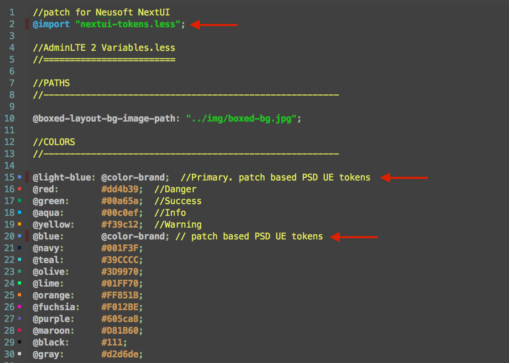

# ReactJS-AdminLTE

ReactJS version of the original AdminLTE dashboard - https://github.com/almasaeed2010/AdminLTE

### Patch for PSD UE Tokens:
1. in package.json add "neusoft-psd-ux_design-tokens" dependencies module
2. (TODO by grunt)move the file force-base.less from /node_modules/neusoft-psd-ux_design-tokens/dist to /build/less/,and rename to nextui-tokens.less
3. add bellow codes in /build/less/variables.less to use Neusoft PSD UE tokens 
```
@import "nextui-tokens.less";
```

#### variables.less



### UPDATES:

[Widgets created in ReactJS](./reactjs-adminlte/public/widgets)


##### Widgets will use velocity.js animations instead of the originally used JQuery animations wherever possible, for improved performance across all browsers and devices.

[Dashboard-v1 in ReactJS](./reactjs-adminlte/public/dashboardV1)

Will soon be populated with charts.


More stuff coming soon. Stay tuned!


#### Instructions to run

- Fork or clone this repo
- Install nodejs and NPM
- Go to the project folder reactjs-adminlte from your terminal and run npm install
- Run node server.js
- Going to [http://localhost:8080](http://localhost:8080) will render an empty dashboard skeleton in the client-side using ReactJS. Clicking on one of the dashboard options on the left pane displays the original dashboards from AdminLTE.
- Go to [http://localhost:8080/widgets.html](http://localhost:8080/widgets.html) to see available widgets in ReactJS.
- Use [React Developer Tools Chrome Extension](https://chrome.google.com/webstore/detail/react-developer-tools/fmkadmapgofadopljbjfkapdkoienihi?hl=en) to understand the components hierarchy and structure and to track down bugs.

This is still a work in progress and will get better over time. Will try and think of more essential features. Looking for feedback and contributions!

#### Upcoming stuff

- Re-usable chart components
- Command line options to choose between client-side rendering and server-side rendering in ReactJS
- Including D3 / C3 charts 

